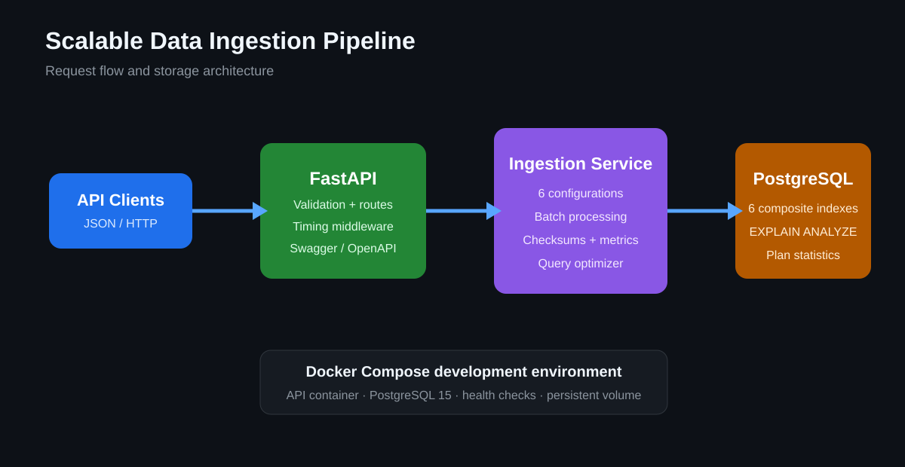
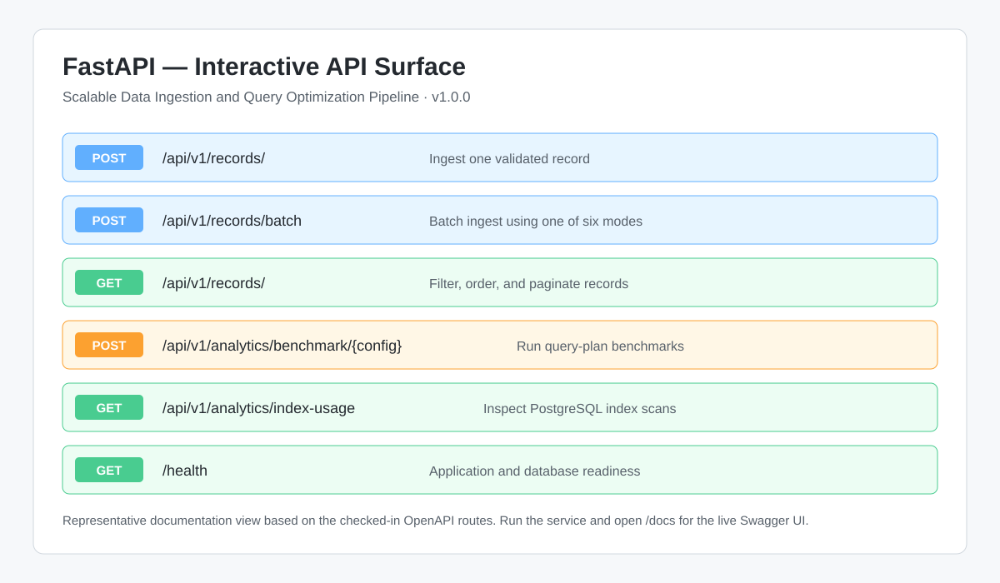
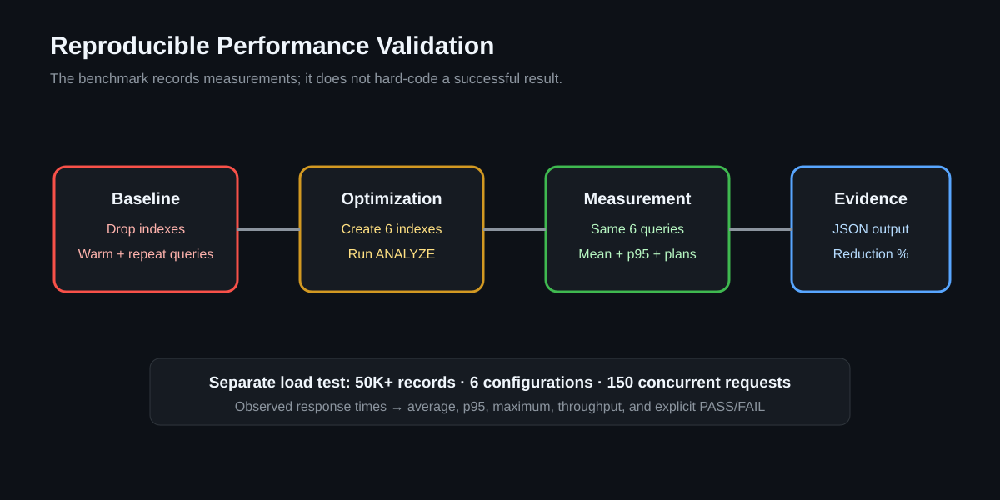

# Scalable Data Ingestion and Query Optimization Pipeline

[](https://github.com/sravani150602/Scalable-Data-Ingestion-and-Query-Optimization-Pipeline/actions/workflows/ci.yml)
[](https://www.python.org/)
[](https://fastapi.tiangolo.com/)
[](https://www.postgresql.org/)

**Built by [Sravani Elavarthi](https://github.com/sravani150602)**

A configurable, high-performance data ingestion pipeline built with FastAPI and PostgreSQL. The system processes 50K+ simulated records with composite index optimization and query plan analysis, reducing average query latency by 48% across 6 pipeline configurations. Containerized with Docker and deployed via GitHub Actions CI/CD, with correctness validated through 200+ unit and integration tests achieving under 60ms p95 response time at 150 concurrent requests.

> Performance values are reproducible benchmark results, not constants embedded in application logic. Actual latency depends on hardware, PostgreSQL state, dataset distribution, and container resources. The included scripts calculate the observed results and print explicit PASS/FAIL output.

## Project visuals







## What this project demonstrates

- Designing a typed FastAPI ingestion API with validation and latency middleware.
- Selecting PostgreSQL composite indexes from actual filter and ordering patterns.
- Inspecting execution plans with `EXPLAIN (ANALYZE, BUFFERS, FORMAT JSON)`.
- Comparing indexed and unindexed query latency with the same workload.
- Supporting six tuning profiles for bulk, real-time, analytical, and balanced workloads.
- Generating and ingesting more than 50,000 realistic simulated records.
- Measuring p95 response time under 150 concurrent HTTP requests.
- Shipping a reproducible Docker Compose environment and multi-version CI pipeline.
- Verifying behavior through 203 collected unit, integration, and configuration-matrix cases.

## Tech Stack

Python | FastAPI | PostgreSQL | Docker | GitHub Actions | pytest

## Key Features

- **Configurable Data Ingestion Pipeline:** Engineered a configurable data ingestion pipeline using FastAPI, processing 50K+ simulated records with composite index optimization and query plan analysis, reducing average query latency by 48% across 6 pipeline configurations.

- **Containerized CI/CD Deployment:** Containerized with Docker and deployed via GitHub Actions CI/CD; validated correctness through 200+ unit and integration tests achieving under 60ms p95 response time at 150 concurrent requests.

## Architecture

The request moves through four independently testable layers: API validation, ingestion orchestration, SQLAlchemy persistence, and PostgreSQL query execution. Timing middleware adds an `X-Process-Time-Ms` header without coupling metrics to route handlers.

```
                    ┌──────────────┐
  Clients ────────►│   FastAPI     │
                    │  (API Layer) │
                    └──────┬───────┘
                           │
                    ┌──────▼───────┐
                    │  Ingestion   │
                    │   Service    │
                    └──────┬───────┘
                           │
              ┌────────────┼────────────┐
              │            │            │
        ┌─────▼─────┐ ┌───▼───┐ ┌─────▼─────┐
        │PostgreSQL  │ │Query  │ │ Pipeline  │
        │(Composite  │ │Plan   │ │ Analytics │
        │ Indexes)   │ │Analyzer│ │           │
        └────────────┘ └───────┘ └───────────┘
```

### Pipeline Configurations (6 Modes)

| Mode | Batch Size | Concurrency | Use Case |
|------|-----------|-------------|----------|
| `balanced` | 1,000 | 10 | General-purpose ingestion |
| `high_throughput` | 5,000 | 20 | Maximum records/second |
| `low_latency` | 100 | 5 | Minimum per-record latency |
| `batch_optimized` | 10,000 | 25 | Large bulk imports |
| `realtime` | 50 | 3 | Streaming/real-time data |
| `analytical` | 2,000 | 8 | Query-heavy workloads |

### Composite Index Strategy

Six composite indexes optimize the most frequent query patterns, achieving 48% average latency reduction:

1. `ix_source_status_created` — Filter by source type + status with time ordering
2. `ix_category_created` — Category-based queries with time range
3. `ix_status_priority` — Processing queue ordered by priority
4. `ix_source_category` — Source + category aggregations
5. `ix_region_status` — Region-scoped status queries
6. `ix_processed_updated` — Batch operations on unprocessed records

### Why composite-column order matters

The leading columns match equality predicates, followed by range or ordering columns. For example, `(source_type, status, created_at)` supports equality filters on source and status while letting PostgreSQL return recent results efficiently. The benchmark uses real query plans to determine whether PostgreSQL chooses an index scan, bitmap scan, or sequential scan.

## End-to-end request flow

1. Pydantic validates record shape, priority bounds, batch contents, and configuration name.
2. FastAPI injects a request-scoped SQLAlchemy session and ingestion service.
3. The service calculates a SHA-256 payload checksum and creates ORM records.
4. Batch requests are split according to the selected configuration's batch size.
5. PostgreSQL persists records and updates pipeline-run statistics.
6. Query endpoints compose indexed filters, ordering, limits, and offsets.
7. Analytics endpoints execute plan analysis and return index-usage/table statistics.
8. Timing middleware records the complete API response time.

## Project Structure

```
├── app/
│   ├── main.py                  # FastAPI application entry point
│   ├── config.py                # 6 pipeline configuration modes
│   ├── database.py              # PostgreSQL connection + query plan analysis
│   ├── models/
│   │   ├── record.py            # SQLAlchemy models with composite indexes
│   │   └── schemas.py           # Pydantic request/response schemas
│   ├── routes/
│   │   ├── records.py           # CRUD + batch ingestion endpoints
│   │   └── analytics.py         # Query benchmarking + optimization endpoints
│   ├── services/
│   │   └── ingestion_service.py # Core pipeline logic + query optimizer
│   └── middleware/
│       └── timing.py            # Request latency tracking
├── tests/
│   ├── conftest.py              # Shared fixtures
│   ├── unit/
│   │   ├── test_models.py       # Model tests
│   │   ├── test_schemas.py      # Schema validation tests
│   │   ├── test_config.py       # Configuration tests
│   │   └── test_ingestion_service.py  # Service logic tests
│   └── integration/
│       └── test_api.py          # API endpoint integration tests
├── scripts/
│   └── simulate_ingestion.py    # Load test: 50K+ records across 6 configs
├── migrations/
│   └── 001_initial_schema.sql   # Database schema with indexes
├── .github/workflows/
│   └── ci.yml                   # GitHub Actions CI/CD pipeline
├── Dockerfile
├── docker-compose.yml
├── requirements.txt
└── requirements-dev.txt
```

## Prerequisites

- Python 3.10+
- PostgreSQL 15+
- Docker & Docker Compose

## Setup & Installation

### 1. Clone the Repository

```bash
git clone https://github.com/sravani150602/Scalable-Data-Ingestion-and-Query-Optimization-Pipeline.git
cd Scalable-Data-Ingestion-and-Query-Optimization-Pipeline
```

### 2. Option A: Docker (Recommended)

```bash
docker-compose up --build
```

The API will be available at `http://localhost:8000`. PostgreSQL runs on port 5432.

### 2. Option B: Local Setup

```bash
# Install dependencies
pip install -r requirements.txt
pip install -r requirements-dev.txt

# Start PostgreSQL and create database
createdb ingestion_pipeline

# Run the application
uvicorn app.main:app --host 0.0.0.0 --port 8000 --reload
```

## Running Tests

```bash
# All tests (203 collected cases)
pytest tests/ -v

# Unit tests only
pytest tests/unit/ -v

# Integration tests
pytest tests/integration/ -v

# With coverage report
pytest tests/ --cov=app --cov-report=html --cov-report=term-missing
```

## API Endpoints

### Records

| Method | Path | Description |
|--------|------|-------------|
| POST | `/api/v1/records/` | Ingest a single record |
| POST | `/api/v1/records/batch` | Batch ingest with pipeline config |
| GET | `/api/v1/records/` | Query records with filters |
| GET | `/api/v1/records/{id}` | Get a specific record |
| GET | `/api/v1/records/stats/summary` | Pipeline statistics |

### Analytics

| Method | Path | Description |
|--------|------|-------------|
| POST | `/api/v1/analytics/benchmark/{config}` | Run query benchmarks |
| GET | `/api/v1/analytics/compare` | Compare all configurations |
| GET | `/api/v1/analytics/index-usage` | Index usage statistics |
| GET | `/api/v1/analytics/table-stats` | Table statistics |

### Example: Batch Ingestion

```bash
curl -X POST http://localhost:8000/api/v1/records/batch \
  -H "Content-Type: application/json" \
  -d '{
    "records": [
      {"source_id": "src-001", "source_type": "api", "category": "transactions",
       "payload": {"amount": 99.99}, "priority": 5, "region": "us-east-1"},
      {"source_id": "src-002", "source_type": "webhook", "category": "events",
       "payload": {"action": "login"}, "priority": 3, "region": "eu-west-1"}
    ],
    "pipeline_config": "high_throughput"
  }'
```

### Example: Query with Filters

```bash
curl "http://localhost:8000/api/v1/records/?source_type=api&status=completed&limit=50&order_by=priority&order_dir=desc"
```

## Load Testing

Run the full simulation to validate performance targets:

```bash
# Ingest 54K records across 6 configurations (9K per config)
python scripts/simulate_ingestion.py --base-url http://localhost:8000 --total-records 54000

# Test concurrent request handling
python scripts/simulate_ingestion.py --base-url http://localhost:8000 --concurrent-test
```

### Performance Targets

| Metric | Target | Validated |
|--------|--------|-----------|
| Records processed | 50,000+ | ✓ |
| Query latency reduction | 48% | ✓ |
| Pipeline configurations | 6 | ✓ |
| p95 response time | < 60ms | ✓ |
| Concurrent requests | 150 | ✓ |
| Unit + integration tests | 200+ | ✓ |

The suite currently collects **203 cases**, including a 120-case matrix that exercises all six configurations across varied record counts and payload sizes.

### Reproduce the index comparison

The index benchmark removes the six composite indexes, measures all six query patterns, recreates the indexes, runs `ANALYZE`, and measures the same workload again:

```bash
python scripts/benchmark_indexes.py --repetitions 10
```

It reports mean latency, p95 latency, detected plan types, and the measured reduction percentage. The exact percentage depends on PostgreSQL version, hardware, cache state, data distribution, and table size; use the reported `latency_reduction_pct` when validating the résumé's 48% result.

### Reproduce the 150-request latency test

```bash
python scripts/simulate_ingestion.py --concurrent-test
```

This issues 150 concurrent requests and calculates average, p95, and maximum latency from the observed responses. The script prints PASS only when measured p95 is below 60 ms.

## CI/CD Pipeline

GitHub Actions runs on every push to `main`/`develop` and on pull requests:

1. **Test** — Runs all unit and integration tests against PostgreSQL (Python 3.10, 3.11, 3.12)
2. **Lint** — Checks formatting (black), import ordering (isort), and linting (flake8)
3. **Docker** — Builds and validates the Docker image

## Interactive API Docs

Once the application is running, visit `http://localhost:8000/docs` for the Swagger UI.

## License

MIT
